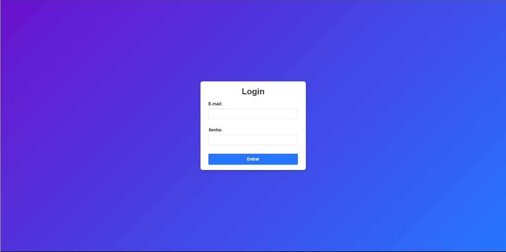
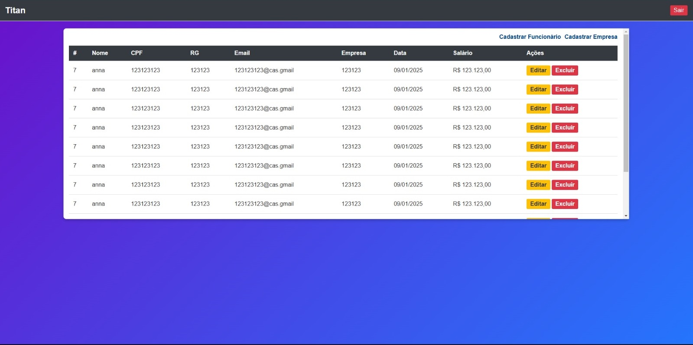
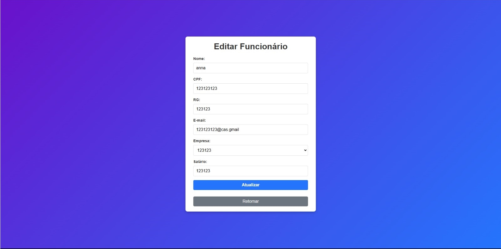
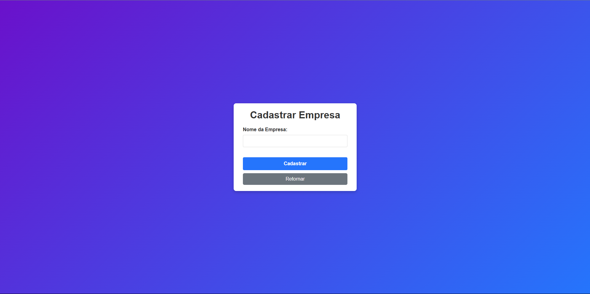

# Sistema de Gerenciamento de Funcionários

Este projeto é um sistema de gerenciamento de funcionários que permite listar, cadastrar, editar e excluir funcionários, além de vincular cada funcionário a uma empresa específica. Ele é desenvolvido em PHP com um modelo default de arquitetura MVC.

## 📋 Funcionalidades

- Listar funcionários com detalhes como nome, CPF, RG, e-mail, empresa, data de cadastro e salário.
- Cadastrar novos funcionários vinculados a empresas.
- Editar informações de funcionários existentes.
- Excluir funcionários.
- Autenticação de usuários com login e logout.
- Suporte para múltiplas empresas.

## 🚀 Pré-requisitos

Antes de começar, você vai precisar ter instalado em sua máquina:

- [PHP](https://www.php.net/)
- [Composer](https://getcomposer.org/)
- [MySQL](https://www.mysql.com/)

### **Funcionalidades Principais:**
- Exibição de funcionários em uma tabela simples interativa.
- Adição, edição e exclusão de funcionários.
- Notificações de sucesso/erro/informações usando o próprio alert.

## **Tecnologias Utilizadas**

- **PHP**: Linguagem principal utilizada para desenvolver o sistema.
- **HTML**: Estrutura principal das páginas, garantindo a organização e semântica do conteúdo exibido ao usuário.
- **CSS**: Responsável pela estilização e design do sistema, garantindo uma interface visual agradável e responsiva.
- **MySQL**: Banco de dados utilizado para armazenar informações de usuários, funcionários e empresas de forma segura e organizada.

## **Instalação e Execução**

### **Passo 1: Clonar o repositório**
Clone este repositório para sua máquina local utilizando o comando:

```bash
git clone git@github.com:AlissonDevPort/php-titan-teste.git
```
Passo 2: Instalar as dependências
Entre na pasta do projeto e instale as dependências:

```bash
composer install
```
Passo 3: Conectar o banco
Atualize o arquivo src/config/database.php com as credenciais do banco de dados

Passo 4: Iniciar a aplicação
Após a instalação das dependências, inicie a aplicação:
```bash
php -S localhost:8000
```

## **Imagens da Aplicação**

### Tela De Login


### Tela Principal


### Adicionando um Novo Funcionário


### Adicionando uma Nova Empresa


---
